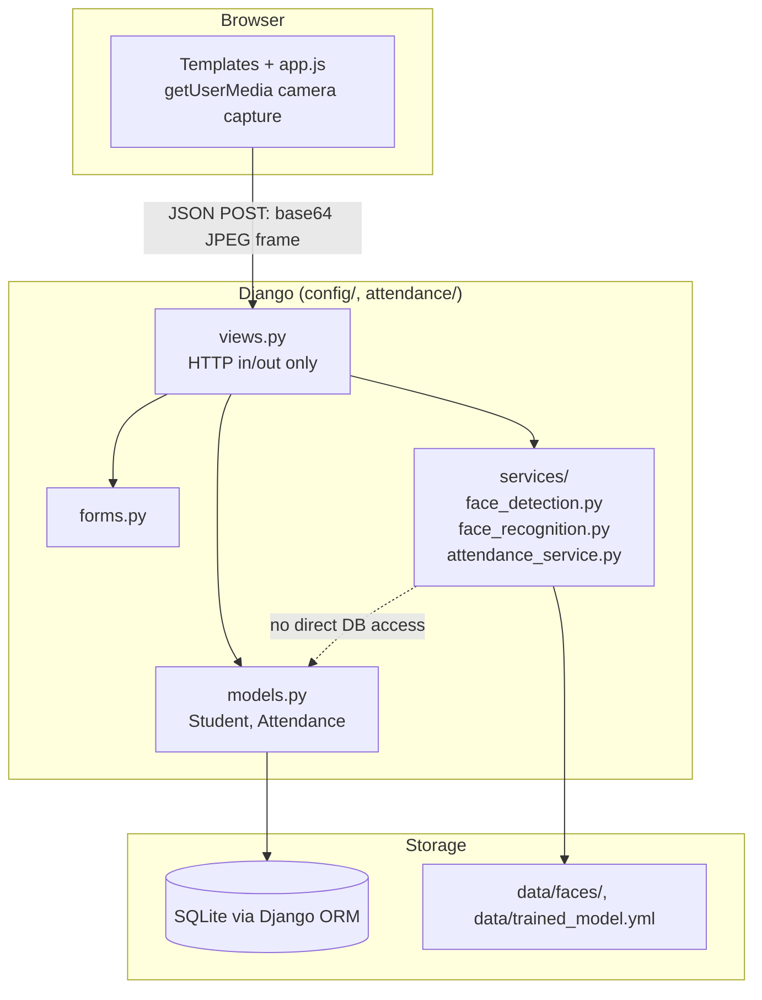
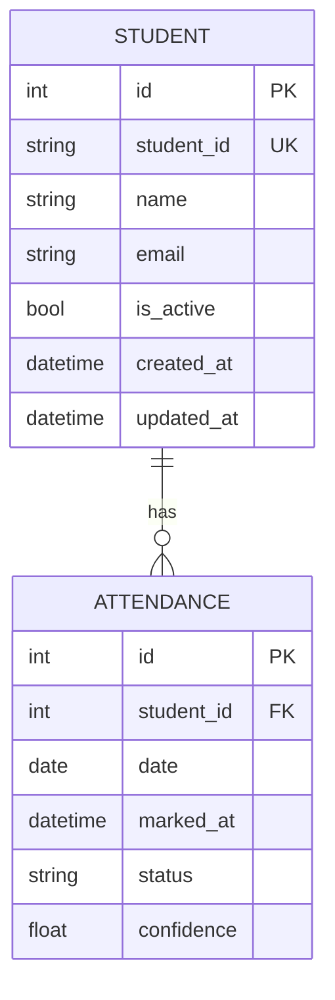
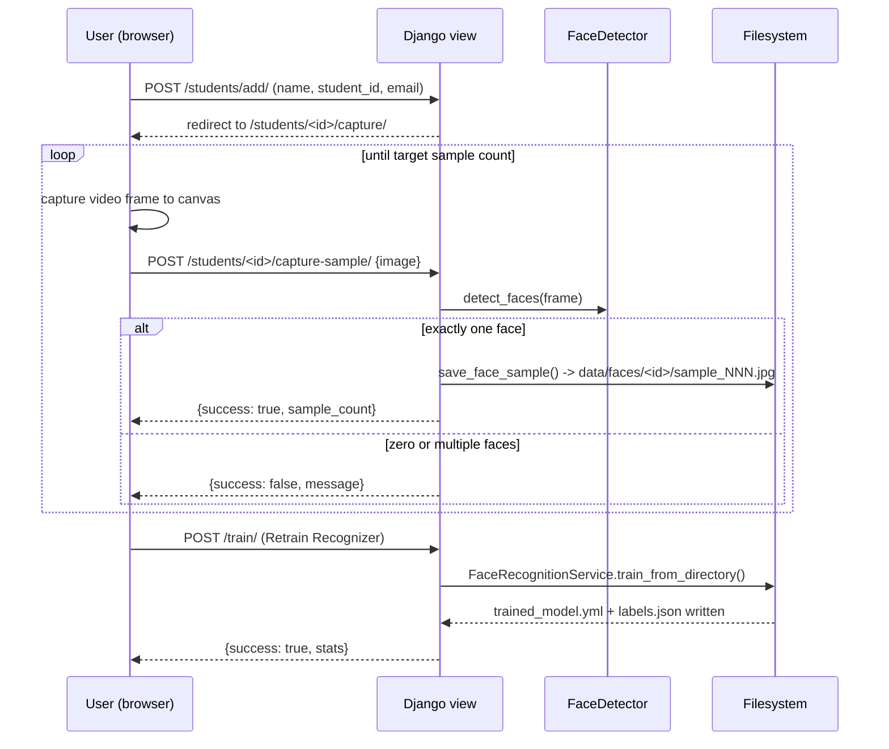
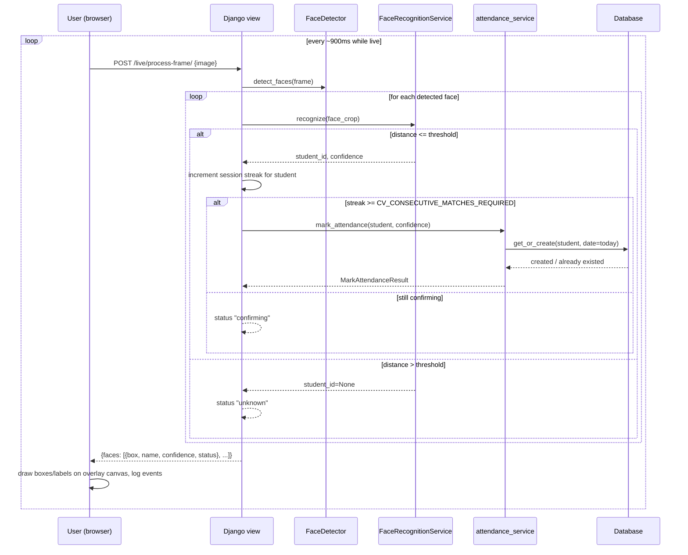

# Architecture

This document describes how the Computer Vision Attendance System is put
together: the Django app structure, the computer-vision pipeline, the data
model, and the main request flows.

## 1. Application architecture

The project is a single Django app (`attendance`) inside a standard Django
project (`config`). Computer vision code lives in `attendance/services/`
and is deliberately independent of Django's request/response cycle - it
only imports Django to read settings, and does so defensively (falling back
to sane defaults if Django isn't configured), so it can also be imported by
the standalone scripts in `scripts/`.

Key decision: **views never call OpenCV directly.** Every `cv2` call lives
in `attendance/services/`. Views parse the incoming frame, hand it to a
service, and turn the service's return value into a JSON/HTML response.
This is what STEP 18 of the project brief asks for ("computer vision is
separated from Django views") and it's also just good practice - the CV
code is unit-testable without spinning up a test client, and the services
are reusable from the standalone `scripts/`.

## 2. Why the browser captures frames, not the server

An earlier, simpler design had the Django server open `cv2.VideoCapture(0)`
directly and stream MJPEG to the browser. That was rejected for this
project:

* The machine running `python manage.py runserver` is not guaranteed to be
  the machine with the classroom webcam attached (e.g. this repository's
  own CI/dev environment has no camera at all).
* Django's development server handles one request at a time by default,
  which conflicts badly with holding a camera device open across requests.
* `getUserMedia()` in the browser works identically on the teacher's
  laptop, a classroom PC, or a tablet, with no server-side camera
  driver/index configuration at all.

Instead: the browser opens the webcam, draws each frame to a `<canvas>`,
and POSTs it as a base64 JPEG to a Django endpoint. The server decodes it
with OpenCV, runs detection + recognition, and returns JSON describing what
it found. The browser draws the bounding boxes/labels back onto an overlay
`<canvas>`. `scripts/test_camera.py` and `scripts/capture_faces.py` are the
exception - they are meant to be run directly on the machine with the
camera, so they use `cv2.VideoCapture` via `VideoCamera` in
`face_detection.py`.

## 3. Computer vision pipeline

* **Face Detection** (`face_detection.py`): a DNN-based detector (Caffe SSD
  ResNet10) if its model files are present under `data/models/`, otherwise
  OpenCV's bundled Haar cascade. The DNN model is more robust to head pose
  and camera angle; the Haar cascade needs no download and works out of
  the box. See the README's "Face Detection Model" section for how to get
  the DNN files.
* **Face Preprocessing** (`face_recognition.preprocess_face`): grayscale
  conversion, resize to a fixed 200x200, then CLAHE (Contrast Limited
  Adaptive Histogram Equalization) to normalize local contrast. CLAHE is
  the main lever for lighting tolerance - it flattens out over/under
  exposure per region instead of applying one global correction.
* **Face Recognition** (`face_recognition.FaceRecognitionService`): OpenCV
  LBPH (Local Binary Patterns Histograms). Trained from scratch on each
  student's saved samples; no external pretrained weights involved.
* **Student Match / Confidence Check**: LBPH's `predict()` returns a
  *distance* (lower = better). Distances above
  `CV_RECOGNITION_DISTANCE_THRESHOLD` are reported as "Unknown" rather than
  forced into a guess.
* **Consecutive-Frame Check**: implemented in `views.process_live_frame`
  using `request.session`, requiring `CV_CONSECUTIVE_MATCHES_REQUIRED`
  consecutive frames of the same student before attendance is written.
  This is a simple temporal-smoothing guard against one lucky/unlucky
  frame - not a Kalman filter or anything fancy, just "did we see the same
  answer three frames in a row."
* **Attendance Service** (`services/attendance_service.py`): wraps
  `Attendance.objects.get_or_create(student, date=today)` in a transaction.
  The (student, date) unique constraint on the model is the actual
  guarantee against duplicates; the service just makes repeated calls a
  harmless no-op instead of an `IntegrityError`.

## 4. Database relationships

`Attendance` has a `UniqueConstraint` on `(student, date)` -
`unique_attendance_per_student_per_day` - enforced by the database, not
just application code. Face-sample images are **not** modeled in the
database; they live on disk at `data/faces/<student_id>/*.jpg` and are
discovered by directory listing (`Student.sample_count`,
`FaceRecognitionService.train_from_directory`). This keeps the schema
simple and keeps binary image data out of SQLite entirely.

## 5. Enrollment flow

## 6. Live attendance / recognition flow

## 7. Error handling

Errors are handled at the layer where they're recoverable, not just caught
at the top and swallowed:

| Condition | Where handled | Behavior |
|---|---|---|
| Webcam unavailable / permission denied (browser) | `app.js` `startCamera()` | Descriptive message shown in the UI; page stays usable |
| Webcam unavailable (standalone scripts) | `face_detection.VideoCamera` | Raises `CameraError` with a clear message; scripts print it and exit non-zero instead of crashing with a traceback |
| Invalid camera index | `VideoCamera.open()` | Same `CameraError` path |
| No face / multiple faces during enrollment | `views.capture_face_sample` | Returns `{success: false, message}`; frontend shows the message and lets the user retry |
| Blurry frame | `face_recognition.blur_variance` + `FrameQualityError` | Sample/frame rejected with an explanatory message instead of silently degrading the model |
| Recognition attempted before training | `FaceRecognitionService._load` raises `ModelNotTrainedError` | Live-attendance view returns a clear JSON message; the page also shows a banner up front if `model_trained` is false |
| Unknown face | `FaceRecognitionService.recognize` | Returned as a normal (non-error) result with `student_id=None`; UI shows "Unknown Face" |
| Duplicate attendance | DB `UniqueConstraint` + `get_or_create` | No exception reaches the user; `mark_attendance` reports `created=False` |
| Invalid student form data | `forms.StudentForm` | Standard Django form errors rendered inline |
| Malformed image payload | `views._decode_base64_image` | Raises `ValueError`, caught in the view, returned as HTTP 400 with a message |

## 8. Notable technical decisions

* **LBPH over a deep embedding model.** Discussed in
  `face_recognition.py`'s module docstring: it trains locally in seconds
  with no pretrained weights, ships inside `opencv-contrib-python`, and its
  accuracy ceiling is honestly lower than a modern embedding network. That
  trade-off is documented, not hidden (see the README's Limitations
  section).
* **DNN detector is optional, Haar cascade is the guaranteed fallback.**
  Nothing about "pip install -r requirements.txt && python manage.py
  runserver" requires downloading extra files. Accuracy improves if you
  take the extra step.
* **Samples are stored pre-processed.** Enrollment images are saved
  *after* grayscale/resize/CLAHE (see `save_face_sample`), so training and
  live recognition apply the exact same transform to their inputs. Training
  on raw images while recognizing on CLAHE'd ones would silently hurt
  accuracy.
* **Session-based streak tracking, not a new model.** Consecutive-match
  confirmation uses `request.session` rather than a new database table -
  it's inherently per-browser-session state, not something that needs to
  outlive the page.
* **SQLite, not Postgres.** Appropriate for a single-classroom portfolio
  deployment; `DATABASES` is the only place you'd touch to swap engines
  later (see README "Future Improvements").
